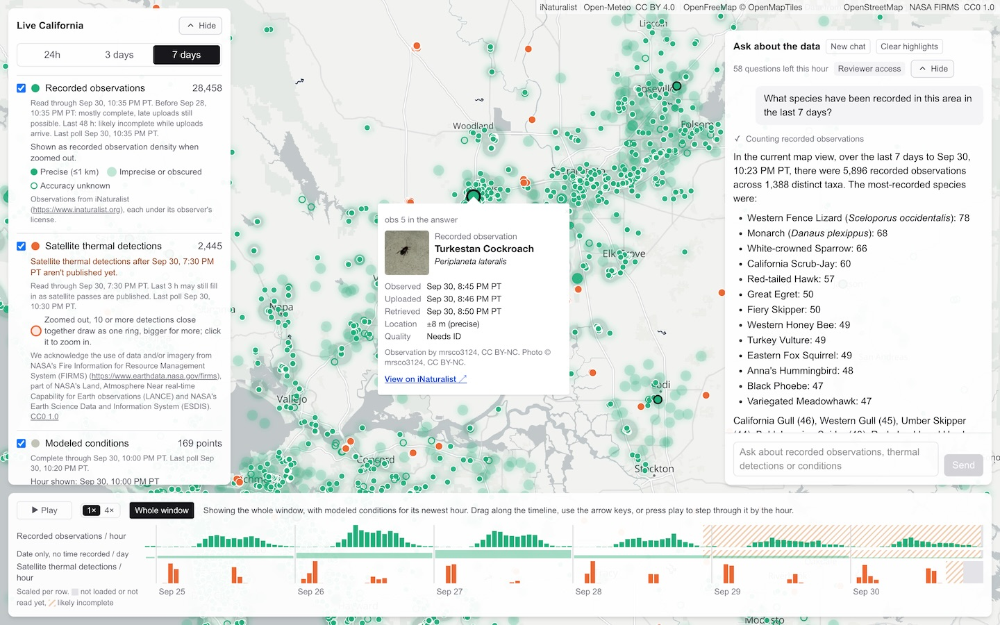
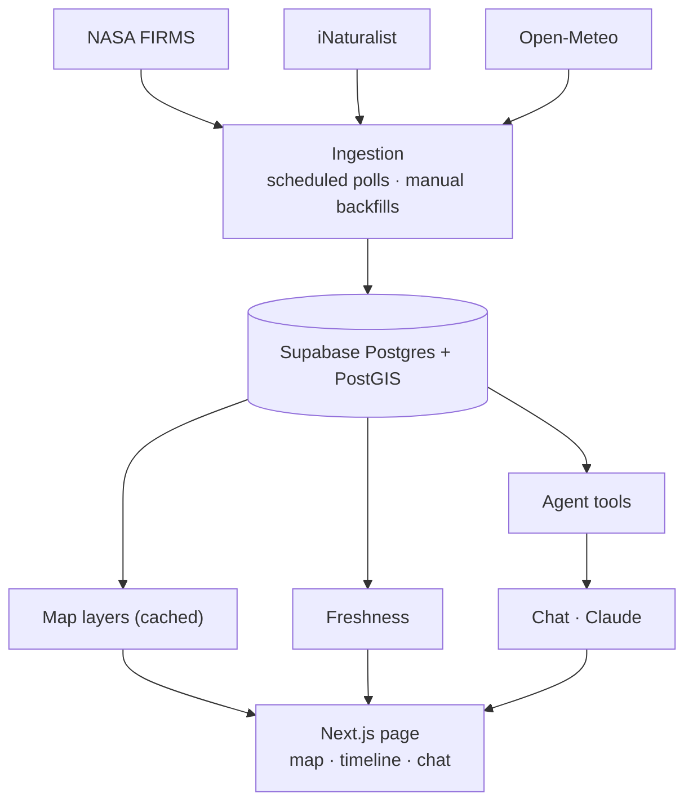

# Ecotone

A California wildfire and wildlife explorer: a map, an hourly timeline and a chat agent over three live data feeds, with every answer traceable to its source records.

Ecotone puts satellite thermal detections (NASA FIRMS), recorded wildlife observations (iNaturalist) and modeled weather (Open-Meteo) for California on one map. Scrub the timeline to replay the last seven days hour by hour, or ask the chat a question in plain English. Every answer cites the records it used, and clicking a citation flies the map to that record.



**Reviewers:** open the link with `?key=…` from the submission email. It only raises the chat's rate limit. There are no accounts.

## Contents

- [Challenge requirements](#challenge-requirements)
- [The question](#the-question)
- [Data sources](#data-sources)
- [Using the app](#using-the-app)
- [Architecture](#architecture)
- [The agent](#the-agent)
- [Stale, missing and conflicting data](#stale-missing-and-conflicting-data)
- [Speed](#speed)
- [New technology: PostGIS](#new-technology-postgis)
- [Key decisions and tradeoffs](#key-decisions-and-tradeoffs)
- [Testing](#testing)
- [How it would evolve](#how-it-would-evolve)
- [Known limitations](#known-limitations)
- [Running it locally](#running-it-locally)
- [How it was built](#how-it-was-built)
- [Attribution](#attribution)

---

## Challenge requirements

| Requirement                                                 | Where                                                                                        |
| ----------------------------------------------------------- | -------------------------------------------------------------------------------------------- |
| Three or more real-time feeds around one question           | NASA FIRMS, iNaturalist and Open-Meteo, polled on a schedule ([Data sources](#data-sources)) |
| Backend for collecting, storing and querying                | Scheduled ingestion into Postgres + PostGIS ([Architecture](#architecture))                  |
| Natural-language queries over real-time and historical data | The chat agent, over anything stored ([The agent](#the-agent))                               |
| Interactive timeline to replay change                       | Hourly scrubbing and playback ([Using the app](#using-the-app))                              |
| A technology new to me                                      | PostGIS ([New technology](#new-technology-postgis))                                          |
| Deployed at a shared URL                                    | https://ecotone-iota.vercel.app                                                              |

---

## The question

> **How do recorded wildlife observations and environmental conditions vary around wildfire activity in California, right now and historically?**

I chose California because of how many wildfires happen there every year and how active iNaturalist is there. Wildlife agencies make decisions around fires in real time: where to send field crews, which areas to survey once a fire is out, and what was recorded in a place before it burned. Answering those means checking a satellite feed, a citizen-science app and a weather model separately. Here it's one question.

I started from a different question: how does wildlife respond to fire? The data can't answer that reliably. Near a fire, people leave, so fewer iNaturalist observations could mean the animals left or the observers did. And FIRMS detects heat, not fire, so a detection isn't always a wildfire. I reframed the question around _recorded_ observations, which the data can support. The app makes no claims about populations or the effect of fire on animals, and says so when asked.

---

## Data sources

| Source          | What it gives                                               | Updated                                                     |
| --------------- | ----------------------------------------------------------- | ----------------------------------------------------------- |
| **NASA FIRMS**  | Satellite thermal detections from three VIIRS satellites    | Every 15 min; detections arrive a few hours after each pass |
| **iNaturalist** | Recorded wildlife observations (animals only)               | Every 5 min, including late uploads and re-identifications  |
| **Open-Meteo**  | Modeled weather (NOAA HRRR) at 169 points across California | Hourly                                                      |

**Why these three.** Each adds something the others can't: FIRMS gives the event (where and when something was hot), iNaturalist the biological signal, and Open-Meteo continuous context everywhere, including wind, the condition most tied to how fire behaves. Considered and cut: GBIF (days of ingestion lag, so not real-time; I used it to check the idea had enough data), eBird (birds only), Movebank (no public tracks overlapping a recent California fire) and USGS earthquakes (doesn't serve the question).

---

## Using the app

- **Map:** recorded observations show as density when zoomed out and as points when zoomed in, drawn differently when their location is imprecise or unknown. Thermal detections group when zoomed out. Wind arrows are on by default, and the weather points can be coloured by gusts, humidity or temperature instead. Click any point for its details and a link to the original record
- **Window:** 24 h, 3 days or 7 days
- **Timeline:** drag the handle or press play. The map shows the 24 hours up to the handle. Grey means a source hasn't been read for that hour yet, and amber hatching means it's probably still filling in
- **Data panel:** layer toggles, counts, and how fresh each source is. Hide it to see more of the map
- **Chat:** suggested questions, the steps the agent takes while it works, numbered citations, and the coverage and limitations behind each answer. Cited records are marked on the map
- **Mobile:** the map comes first. Tap the input bar above the timeline to open the chat, and tap the map or a citation to close it

### Questions to try

- What wildlife was recorded near thermal activity this week?
- Is the largest cluster a fire? _(as a follow-up; it won't answer yes or no)_
- What are conditions right now around here?
- How fresh is the data right now?
- Did the fires cause wildlife populations to decline?

---

## Architecture



**Stack:** Next.js + TypeScript, Tailwind, Supabase Postgres + PostGIS, raw SQL with postgres.js, MapLibre, TanStack Query, Claude via the Vercel AI SDK, Zod, Vitest. Hosted on Vercel, which also runs the scheduled polls.

- **Ingestion:** every source follows the same steps: fetch, validate, normalize, upsert. Live polling and backfills share everything but the fetch. Re-running ingestion never duplicates data, a failed run never deletes any, and a partial run is never shown as complete. Every run is recorded, and that record is what the app uses to say how complete each source is
- **Storage:** one table per source, since a detection, an observation and a weather reading mean different things. Each record keeps its observed, uploaded and retrieved times apart, plus a link back to its source and its license
- **Why store at all instead of proxying the APIs:** the timeline can't scrub smoothly over data it has to fetch, FIRMS and iNaturalist can't be joined spatially upstream, and an answer should be checkable against a record of what the app actually saw
- **Agent tools:** plain functions over an area and a time range that know nothing about chat, so they're tested without calling a model

---

## The agent

The model never writes SQL and never sees raw data. It picks from six tools: data status, observation summaries, period comparisons, detection clusters, observations near detections, and weather conditions. Each tool returns its result together with the evidence, the coverage behind it and its limitations.

- The map's current view and time window go along with every question, so "here" and "this week" mean what's on screen
- Guardrails live in the tools, not the prompt: comparisons need enough records, and a tool says when too little of the range has been read
- Citations are checked against what the tools actually returned; anything else is removed, and the answer says so

**Why it's built this way.** The map and timeline handle selection (where and when); the agent handles analysis over that selection.

I chose fixed tools over text-to-SQL or RAG because the questions are exact: counts in an area, distances, time windows, rates. Embeddings don't help with "how many observations within 10 km of this cluster in 48 hours", and model-written SQL can't carry guardrails like minimum counts or coverage thresholds. Those live in tool code, where they are tested. The cost is that the agent can only answer what the tools cover.

It refuses claims about populations, causation or displacement because the records can't support them. Asked whether fires caused wildlife to decline, it explains that recorded observations follow observer effort, then reports what the records do show.

Testing changed the design. The first version of the proximity tool returned the closest pairs statewide, and those were mostly next to small heat sources near towns while the largest fire never appeared. It now reports per fire cluster, largest first. Separately, after the map moved, the model "corrected" earlier answers that were right for the earlier view, so each question now carries the view it was asked with.

---

## Stale, missing and conflicting data

The app treats "we don't know" as a state to show, never as zero.

- **Stale:** each source shows when it was last polled and how far it's been read, and says so when polling falls behind. A weather point with no reading for the current hour shows its last one, faded, with its age
- **Missing:** hours a source hasn't read yet are grey on the timeline, not zero. An empty result is stated plainly, and no observations is never presented as no animals. Missing location accuracy is treated as unknown, not exact
- **Incomplete:** the newest hours, which can still fill in, are marked on the timeline. Tools answer over the hours actually read and say how many that was
- **Conflicting or uncertain:** observed, uploaded and retrieved times are kept separate, and weather is labelled as modeled, with the distance to the point it came from
- **Failures:** a failed run leaves earlier data intact, and the source shows as degraded

---

## Speed

- Each layer loads its whole 7-day window once, so switching windows and scrubbing the timeline never wait on the network
- Map layers are cached at the edge, so most visitors never reach the database
- The timeline is counted in the browser from the loaded data and redraws at most once per frame
- The chat streams the agent's steps as it works, so the wait shows what's happening, and caches its prompt so follow-up questions cost less

---

## New technology: PostGIS

I hadn't used PostGIS before. I picked it over other new-to-me options (React Native, Three.js, a RAG pipeline) because it solved a core problem instead of just being new: the question is about what happens _near_ thermal activity, which is a spatial join across sources.

It handles distances in metres, proximity searches, clustering detections into fires, and keeping counts inside California's outline.

---

## Key decisions and tradeoffs

The full log, with the alternatives behind each, is in [docs/decisions.md](docs/decisions.md).

| Decision                                           | Alternatives considered                              | Why / tradeoff                                                                                                                                                                                               |
| -------------------------------------------------- | ---------------------------------------------------- | ------------------------------------------------------------------------------------------------------------------------------------------------------------------------------------------------------------ |
| Live California as the default, one bounded region | Global explorer; historical-first with a live button | Real-time is the core of the brief, and one region keeps every view populated. Tradeoff: no coverage elsewhere, and history is only what has been stored                                                     |
| Store the data instead of proxying APIs            | Query upstream on demand                             | Replay, cross-source spatial queries and reproducible answers. Tradeoff: ingestion code to maintain, storage cost, and data can trail upstream by a poll interval                                            |
| Typed tables per source, raw SQL, no ORM           | Generic event/value table; Prisma                    | The sources mean different things, and PostGIS functions are first-class in SQL where an ORM would hide them. Tradeoff: each new source needs its own table and hand-written types                           |
| Fixed tools, no text-to-SQL, no RAG                | LLM-written SQL; vector search                       | Exact numeric and spatial questions, with guardrails in tested code. Tradeoff: only questions the tools cover                                                                                                |
| Report coverage gaps instead of refusing           | Refuse on any gap; ignore gaps                       | Live feeds always have a few unread hours, so refusing on any gap meant refusing constantly. Answers use only the hours read and say so. Tradeoff: the cut-off for "too little to answer" is a judgment call |
| Load the whole window once, filter in the browser  | Refetch per pan or per scrub                         | Scrubbing and window switches are instant. Tradeoff: only works while a window's data stays small                                                                                                            |
| Agent before the CZU case study                    | CZU first with a thinner agent                       | The agent was a requirement; CZU was mine. Tradeoff: "historical" means since Sep 22, 2026, not 2020                                                                                                         |
| Rate limits in Postgres                            | In-memory; Redis; Vercel firewall                    | In-memory counters don't survive serverless, Redis is new infrastructure, and one table handles everything. Tradeoff: a database write per question                                                          |

---

## Testing

- **Tests** (`pnpm test`): focused where a bug would make the app misleading, such as normalization, time handling, spatial queries, period comparisons, guardrails and ingestion that can safely re-run. Upstream APIs are mocked, and database tests run against a local Supabase stack
- **Agent evals** (`pnpm eval`): twelve questions sent to the deployed chat and graded by code. They check that answers have text, avoid claims like "population" or "fire spread" unless refusing them, never answer "is this a fire?" with a yes or no, and don't take back earlier answers after the map moves

The evals check behaviour, not exact numbers, because live data changes. Code grading is stable and cheap and can't drift the way a second model grading the first can. The first run passed 10 of 12. One failure came from bugs in the eval itself. The other was real: a question asking for many lookups at once came back empty. A fix got it further, but it still runs out of time before answering (see limitations).

---

## How it would evolve

- **More data:** loading a whole window into the browser stops working first. The next step is aggregating on the server or serving vector tiles, and pruning old rows, which nothing does today
- **More history:** the tools already take any area and time range, so the agent could fetch missing history on request for the current view. The CZU Lightning Complex (2020) would be the first case study, comparing recorded observations before, during and after the fire
- **More traffic:** the map is already cached at the edge. Next would be rate limiting before requests reach the app, and making the heaviest agent tool cheaper (it repeats work today)
- **More users:** a read replica for the agent, and map refreshes that fetch only what's new
- **More sources:** a new source follows the same ingestion steps, with its own table

---

## Known limitations

- No historical case study yet: "historical" means everything stored since the live window was first loaded (Sep 22, 2026)
- Recorded observations follow observer effort: weekends spike, and the newest day or two are undercounted while uploads arrive
- Thermal detections can include industrial heat sources, and one large fire shows as one cluster
- Weather values come from the nearest of 169 sample points, which can be up to about 35 km away, farther near the coast
- Introduced species aren't highlighted: I couldn't verify iNaturalist's flag for California, so I left it out rather than risk a wrong label
- A question asking for many lookups at once can run out of time and end without an answer
- Tests run one file at a time because they share the local database with development

---

## Running it locally

The deployed demo needs nothing installed. To run it yourself you need Node 20+, pnpm, Docker, the Supabase CLI, a free [FIRMS map key](https://firms.modaps.eosdis.nasa.gov/api/map_key/) and an Anthropic API key.

```bash
pnpm install
supabase start                 # local Postgres + PostGIS
supabase db reset              # applies supabase/migrations/
cp .env.example .env.local     # then fill in the values
pnpm dev                       # http://localhost:3000
```

The main environment variables are `DATABASE_URL`, `FIRMS_MAP_KEY`, `ANTHROPIC_API_KEY`, `CRON_SECRET` and `IP_HASH_SECRET`; `.env.example` lists the rest.

Nothing polls locally, so load the last week by hand:

```bash
curl -X POST -H "Authorization: Bearer $CRON_SECRET" http://localhost:3000/api/backfill/open-meteo
curl -X POST -H "Authorization: Bearer $CRON_SECRET" http://localhost:3000/api/backfill/firms
# iNaturalist takes one date per call
curl -X POST -H "Authorization: Bearer $CRON_SECRET" "http://localhost:3000/api/backfill/inaturalist?date=2026-09-29"
```

Checks: `pnpm test`, `pnpm lint`, and `pnpm exec tsc --noEmit` (run `pnpm exec next typegen` first in a fresh checkout).

---

## How it was built

Built with Claude Code, in small phases. For each phase I agreed to the plan first, Claude Code implemented it in its own workspace using Conductor, other models reviewed the diff, and I reviewed and merged every PR myself ([PR history](https://github.com/MikeCris89/ecotone/pulls?q=is%3Apr)).

`docs/project-brief.md` and `docs/decisions.md` were the source of truth, and `AGENTS.md` held the rules every change had to follow (terminology like "recorded observations" and "thermal detections", unknown is never zero). Decisions Claude proposed are marked "Suggested by Claude; I agreed" in the log, and I changed several of its plans: the tools first refused any range with a gap in the data, which I changed to answering over what was read and saying so, and on phones I replaced its chat bubble with the chat's own input bar.

Quality came from targeted tests per change, browser testing of each phase locally and in production, code review from me and other agents, and the evals.

I spent most of the 72 hours on this project. With more time, I would add:

- The CZU Lightning Complex (2020) as a historical case study: how recorded observations changed before, during and after the fire, in a well-documented area. The tools already accept any area and time range, so most of the work is loading the historical data.
- A daily briefing: a scheduled agent run that flags patterns standing out in the last 7 days, saved with its evidence and shown as a pinned card with highlights on the map.
- On-demand history: fetch past data from the APIs when a user asks about a period or area that isn't stored yet.

---

## Attribution

- Satellite thermal detections: We acknowledge the use of data and/or imagery from NASA's Fire Information for Resource Management System (FIRMS) (https://www.earthdata.nasa.gov/firms), part of NASA's Land, Atmosphere Near real-time Capability for Earth observations (LANCE) and NASA's Earth Science Data and Information System (ESDIS).
- Recorded observations: [iNaturalist](https://www.inaturalist.org), each under its observer's license
- Modeled weather: [Weather data by Open-Meteo.com](https://open-meteo.com/), CC BY 4.0
- State outline: US Census Bureau TIGER/Line
- Basemap: [OpenFreeMap](https://openfreemap.org), © OpenStreetMap contributors
